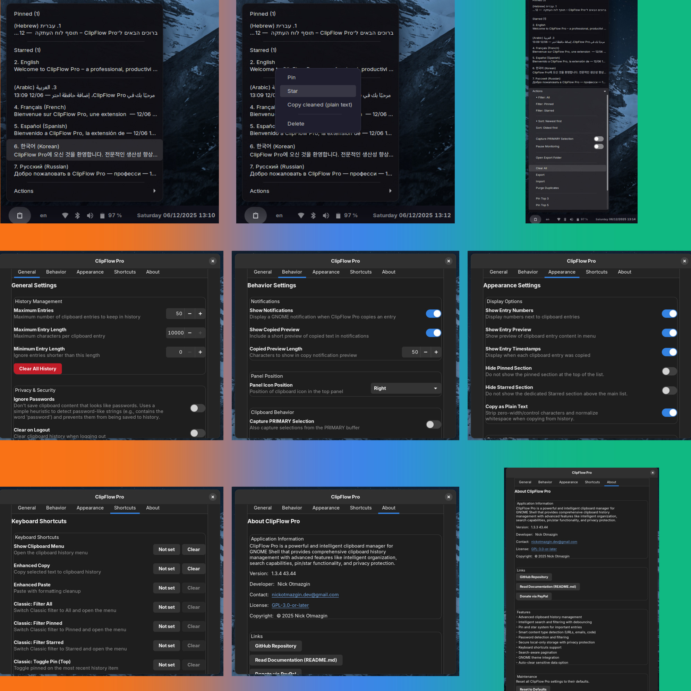
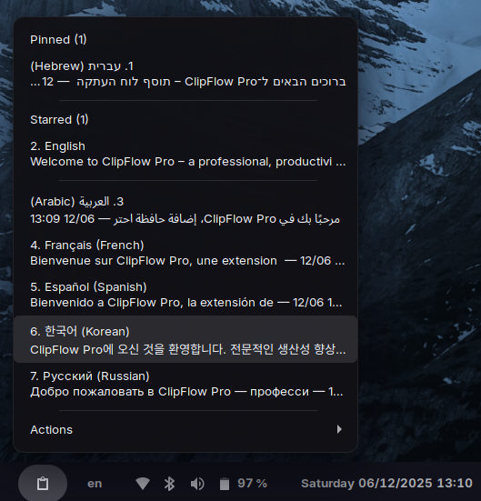
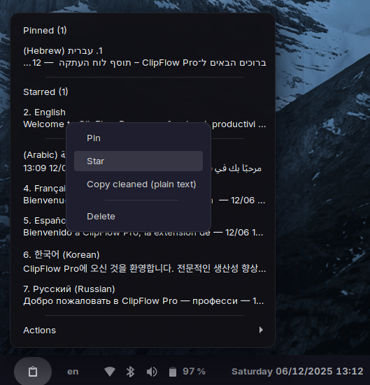
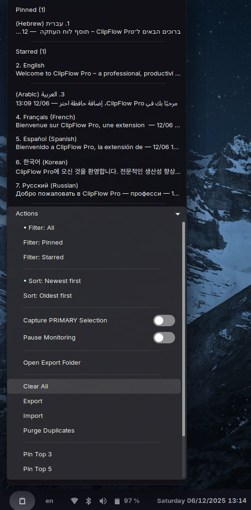
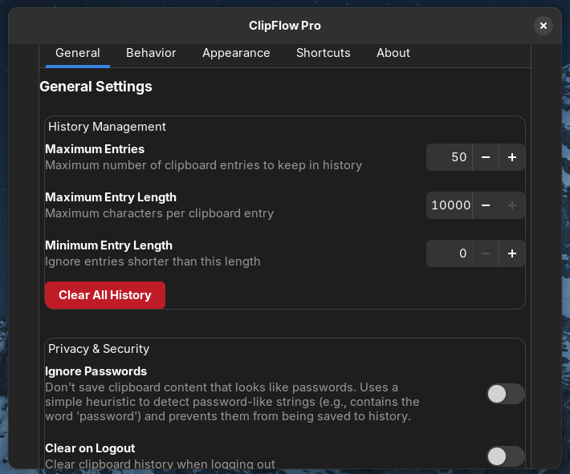
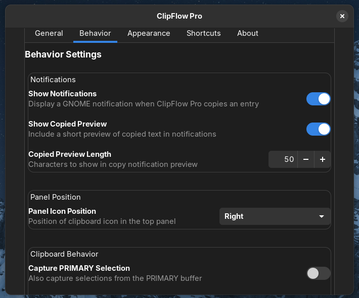
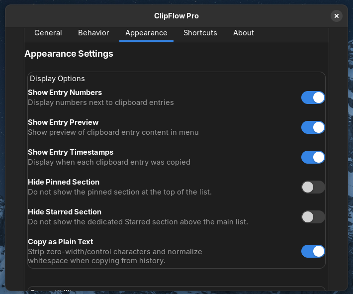
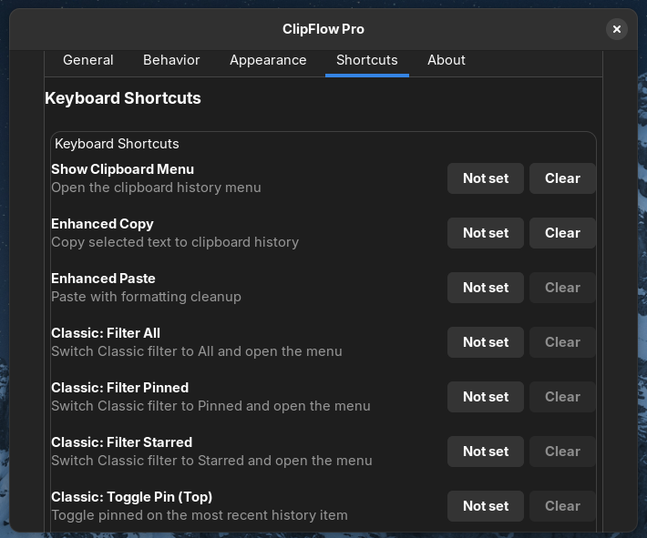
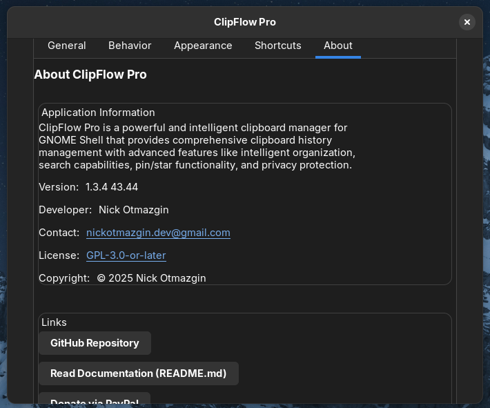

# ClipFlow Pro

[What’s New in 1.3.4](CHANGELOG.md)

[](https://github.com/sponsors/nickotmazgin)

Clipboard history manager for GNOME Shell (UUID `clipflow-pro@nickotmazgin.github.io`).

## Compatibility

- GNOME 43–44: Classic UI by default (Enhanced available via toggle)
- GNOME 45–47: Enhanced UI with container + pagination (Classic available)
- Features:
  - Pinned strip, Starred section, Others list
  - Quick filters (All / Pinned / Starred) with active highlighting
  - Per‑row actions: Pin, Star, Copy, Copy Cleaned, Delete
  - Show more/less for large histories
  - Keyboard shortcuts for filters and top item toggles
  - Export/Import, Purge duplicates, Pin Top 3/5, Unpin All
  - Reset to Defaults in Preferences → About → Maintenance

## Links

- EGO Review Guidelines: https://gjs.guide/extensions/review-guidelines/review-guidelines.html
- GitHub Releases: https://github.com/nickotmazgin/clipflow-pro/releases
- Issues & Support: https://github.com/nickotmazgin/clipflow-pro/issues

## Installation (local dev)

```
./build.sh
mkdir -p ~/.local/share/gnome-shell/extensions/clipflow-pro@nickotmazgin.github.io
cp -r build/* ~/.local/share/gnome-shell/extensions/clipflow-pro@nickotmazgin.github.io/
gnome-extensions enable clipflow-pro@nickotmazgin.github.io
# Restart GNOME Shell: Alt+F2 → r → Enter
```

## Packaging (extensions.gnome.org)

- Run `./package.sh` to produce two zips in `dist/`:
  - 43–44 zip with `shell-version: ["43","44"]` (from build/metadata.json)
  - 45–47 zip with `shell-version: ["45","46","47"]` (generated in a temp dir)
- Upload both zips under the same UUID. EGO will serve the correct build automatically.

### Compliance notes (1.3.4)

- Removed `stylesheet` from `metadata.json` (EGO guideline)
- No Gtk imports in the shell process
- No spawn-based clipboard fallbacks (xclip/xsel removed)
- History and import use async reads via `Gio.File.load_contents_async`
- Verbose logs only when `enable-debug-logs` is enabled

This branch targets GNOME 45–47. For GNOME 43–44, see the `gnome43-44` branch.

### Sorting & Pagination

- Enhanced UI: pinned → starred → newest-first; paginated by `entries-per-page`
- Classic UI: same ordering with quick filters and “Show more/less” batching


## Screenshots (1.3.4)



<table>
  <tr>
    <td align="center"><br><sub>1</sub></td>
    <td align="center"><br><sub>2</sub></td>
    <td align="center"><br><sub>3</sub></td>
  </tr>
  <tr>
    <td align="center"><br><sub>4</sub></td>
    <td align="center"><br><sub>5</sub></td>
    <td align="center"><br><sub>6</sub></td>
  </tr>
  <tr>
    <td align="center"><br><sub>7</sub></td>
    <td align="center"><br><sub>8</sub></td>
    <td align="center"><br><sub>9</sub></td>
  </tr>
</table>

## Support

If you find this project useful, you can support development:

[](https://github.com/sponsors/nickotmazgin)
[](https://www.paypal.com/donate/?hosted_button_id=4HM44VH47LSMW)
