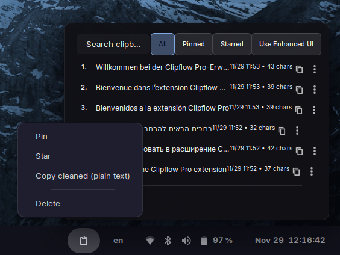
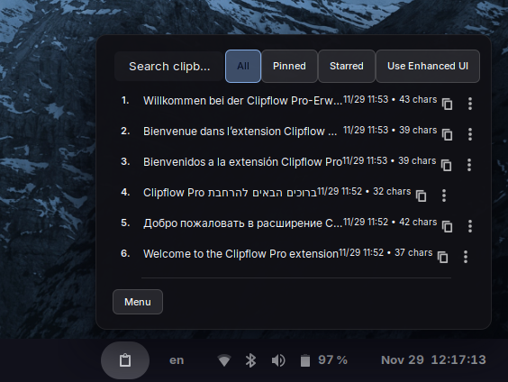
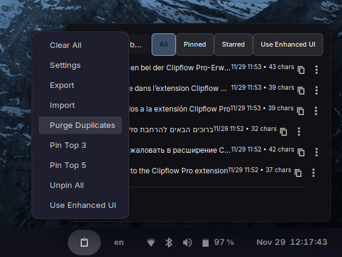
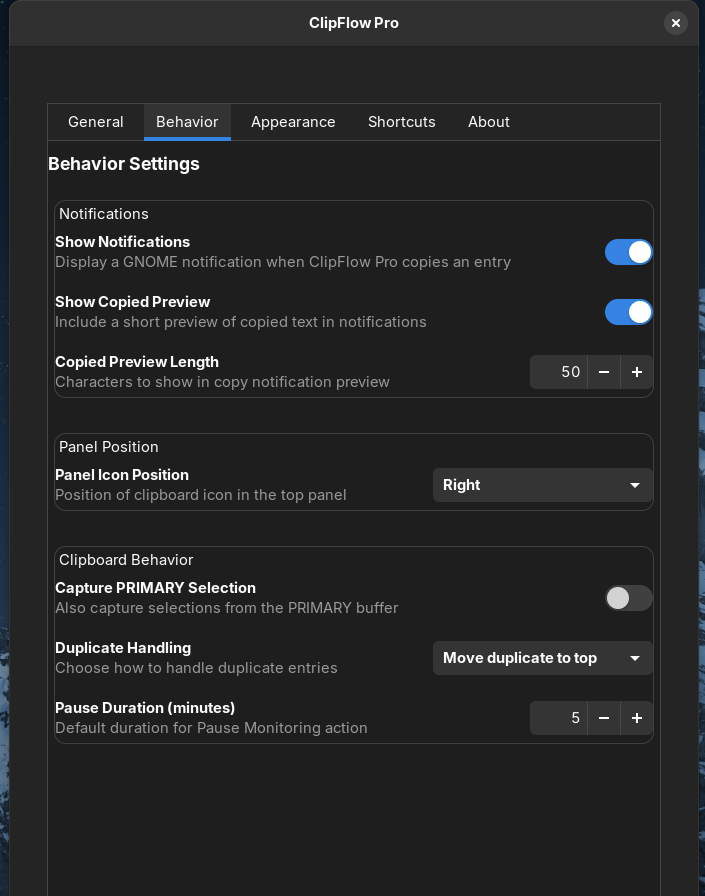
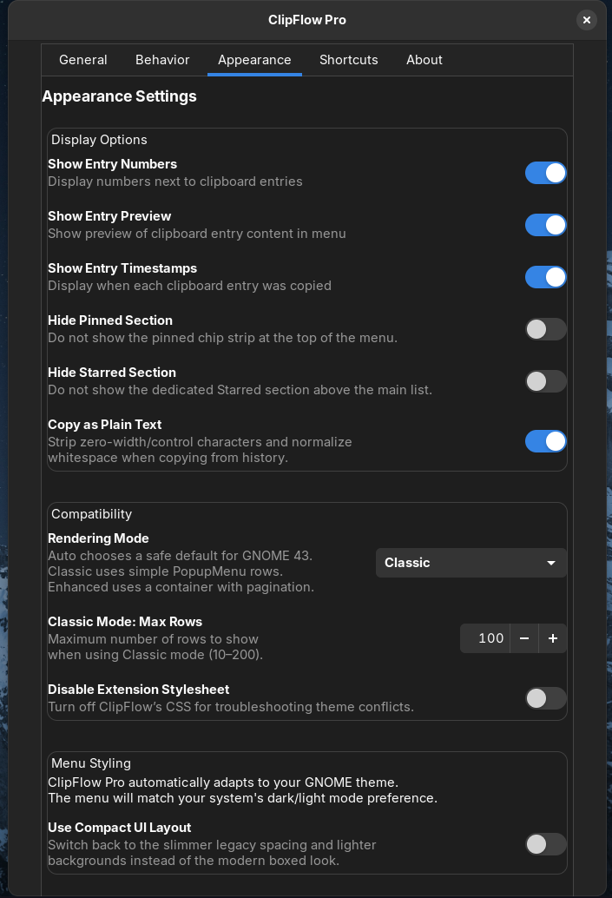
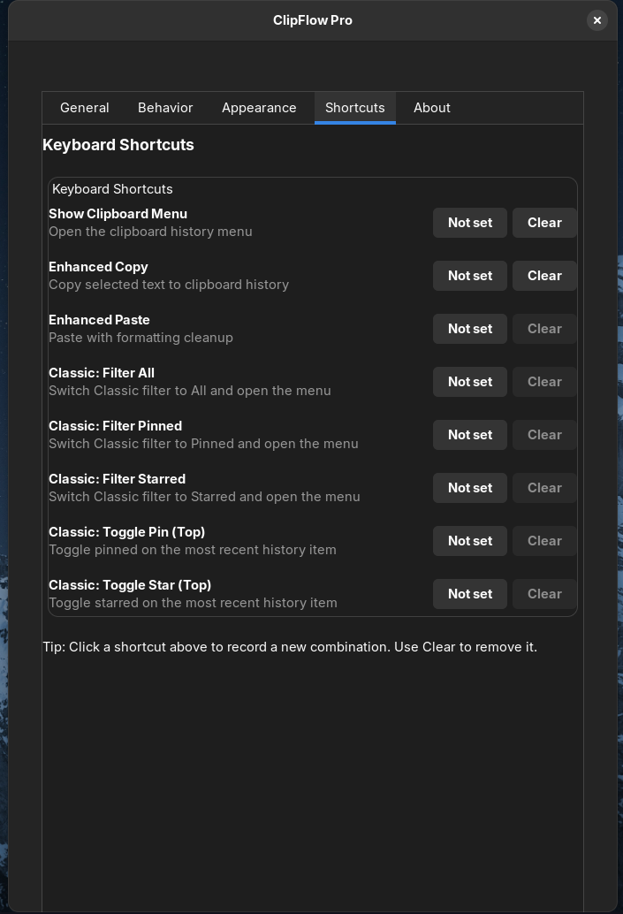
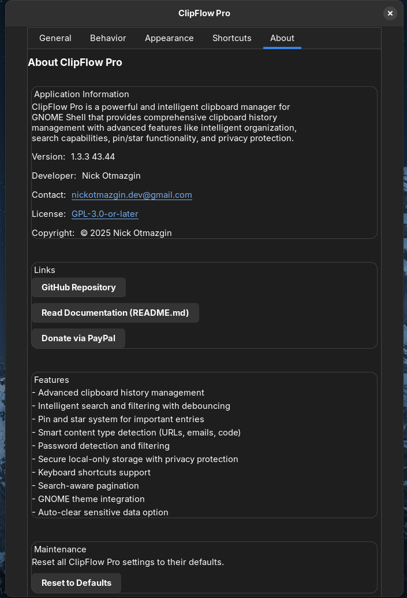

# ClipFlow Pro (GNOME 43–44)

Unified Classic+ build for GNOME 43–44 under the UUID `clipflow-pro@nickotmazgin.github.io`.

## Compatibility

- GNOME 43–44: Classic UI is the default (Enhanced available via toggle)
- Classic+ includes:
  - Pinned strip, Starred section, Others list
  - Quick filters (All / Pinned / Starred) with active highlighting
  - Per‑row actions: Pin, Star, Copy, Copy Cleaned, Delete
  - Show more/less for large histories
  - Keyboard shortcuts for filters and top item toggles
  - Export/Import, Purge duplicates, Pin Top 3/5, Unpin All
  - Reset to Defaults in Preferences → About → Maintenance

## Installation (local dev)

```
./build.sh
mkdir -p ~/.local/share/gnome-shell/extensions/clipflow-pro@nickotmazgin.github.io
cp -r build/* ~/.local/share/gnome-shell/extensions/clipflow-pro@nickotmazgin.github.io/
gnome-extensions enable clipflow-pro@nickotmazgin.github.io
# Restart GNOME Shell: Alt+F2 → r → Enter
```

## Packaging (extensions.gnome.org)

- This build’s `metadata.json` declares `shell-version: ["43","44"]`.
- Upload this zip alongside the GNOME 45–47 ESM zip under the same UUID.
- EGO will serve the correct build automatically based on the user’s GNOME Shell version.


## Screenshots (1.3.3)


<table>
  <tr>
    <td align="center"><br><sub>1</sub></td>
    <td align="center"><br><sub>2</sub></td>
    <td align="center"><br><sub>3</sub></td>
  </tr>
  <tr>
    <td align="center"><br><sub>4</sub></td>
    <td align="center"><br><sub>5</sub></td>
    <td align="center"><br><sub>6</sub></td>
  </tr>
  <tr>
    <td align="center"><br><sub>7</sub></td>
    <td align="center"><br><sub>8</sub></td>
    <td align="center"><br><sub>9</sub></td>
  </tr>
</table>
