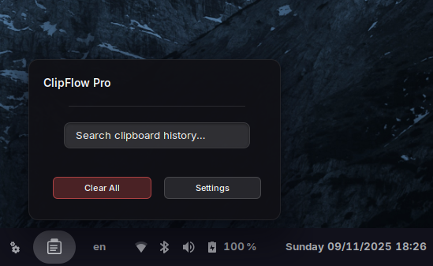
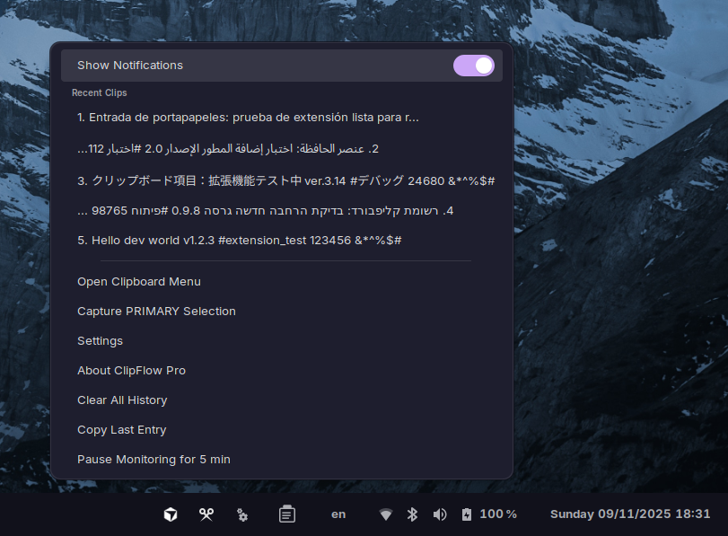
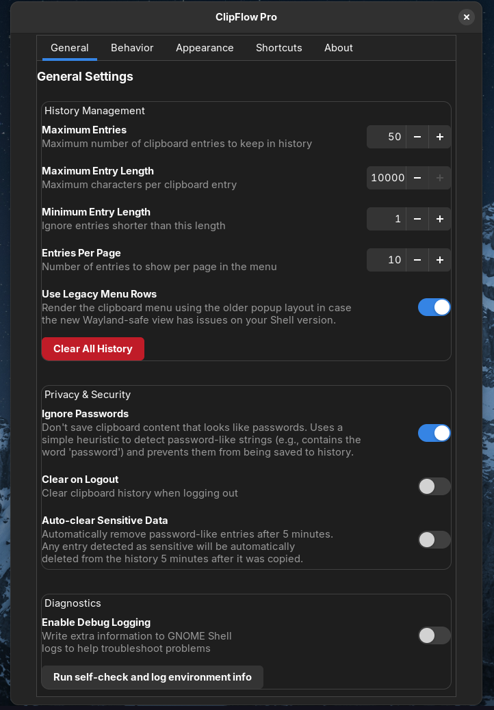
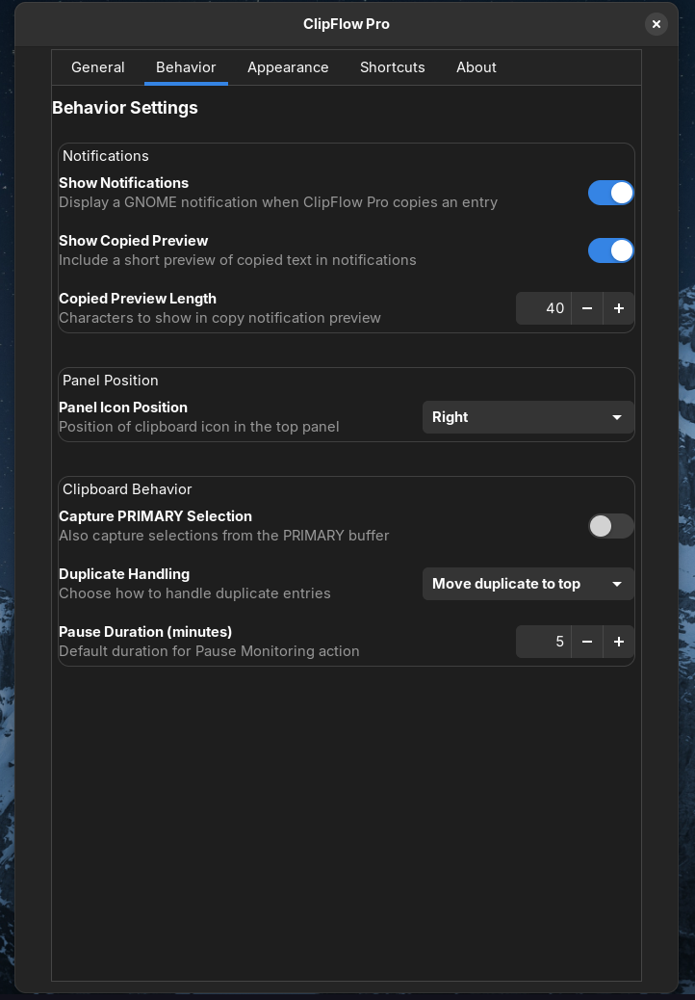
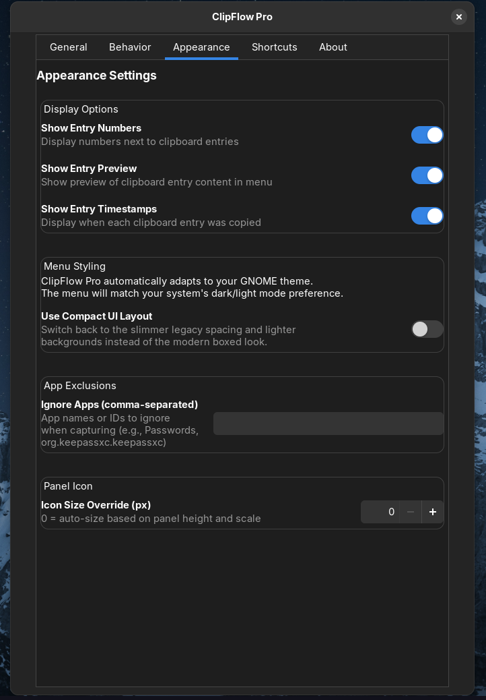
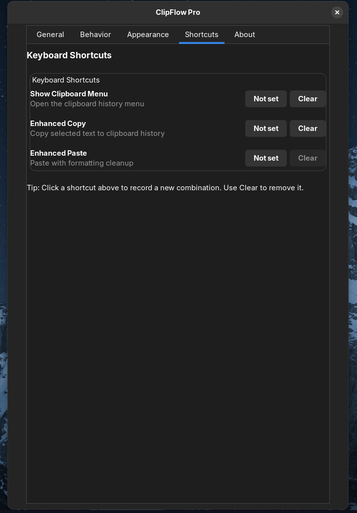
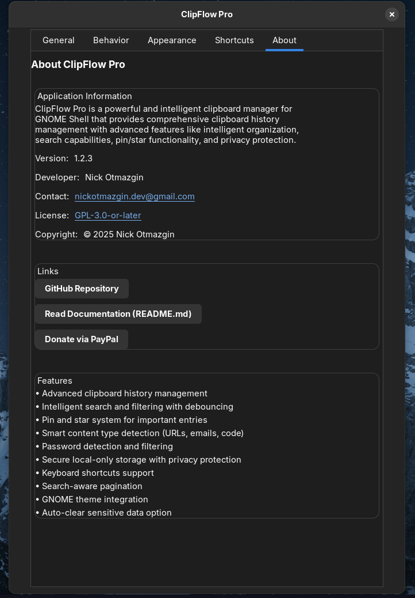

# ClipFlow Pro


[](https://github.com/nickotmazgin/clipflow-pro/actions/workflows/codeql.yml)
[](https://extensions.gnome.org/extension/8793/clipflow-pro/)

**Advanced Clipboard Manager for GNOME Shell**

ClipFlow Pro is a powerful and intelligent clipboard manager that provides comprehensive clipboard history management with advanced features like intelligent organization, search capabilities, pin/star functionality, and auto-copy on selection.

## 🚀 Install Now

**📦 Available on extensions.gnome.org:**

[**👉 Install ClipFlow Pro from extensions.gnome.org**](https://extensions.gnome.org/extension/8793/clipflow-pro/)

The easiest way to install, manage, and update ClipFlow Pro is through the [GNOME Extensions website](https://extensions.gnome.org/extension/8793/clipflow-pro/) or the Extensions app.

Compatibility: GNOME Shell 45–47 (ESM)

Note: This release uses the GNOME 45+ ES Modules format and libadwaita preferences. Older GNOME versions (≤44) are no longer declared as supported in this package.

Developer tooling
- Validate package layout before upload: `make ego-validate`
- Create flat EGO zip + source zip: `make dist`
- Issue templates: open “EGO Review Feedback” or “Release Checklist” from GitHub → New Issue

## Features

### 🚀 Core Features
- **Advanced Clipboard History**: Keep track of all your clipboard entries with intelligent categorization
- **Smart Search & Filtering**: Find clipboard entries quickly with powerful search and category filtering
- **Pin & Star System**: Mark important entries for quick access
- **Auto-copy on Selection**: Automatically copy selected text to clipboard history
- **Keyboard Shortcuts**: Full keyboard support for power users

### 🔒 Privacy & Security
- **Password Detection**: Automatically detect and optionally ignore password-like content
- **Sensitive Data Protection**: Clear sensitive data with one click
- **Auto-clear Sensitive Data**: Automatically remove sensitive entries after 5 minutes
- **Secure Data Handling**: Proper cleanup of sensitive information

### 🎨 User Experience
- **Modern UI**: Beautiful, responsive interface that adapts to your GNOME theme
- **Intelligent Categorization**: Automatically categorize entries (URLs, emails, code, files, etc.)
- **Pagination Support**: Handle large clipboard histories efficiently
- **Right-click Integration**: Context menu integration for file operations

### ⚙️ Customization
- **Comprehensive Settings**: Extensive configuration options
- **Theme Integration**: Automatically adapts to dark/light themes
- **Customizable Shortcuts**: Configure keyboard shortcuts to your preference
- **Panel Position**: Choose where to place the clipboard icon

## Screenshots

<div align="center">
  
  <p><em>Panel indicator with the full clipboard history menu.</em></p>
</div>

<div align="center">
  
  <p><em>Quick context menu with the five most recent entries.</em></p>
</div>

<table>
  <tr>
    <td align="center">
      <br>
      <sub><strong>General</strong></sub>
    </td>
    <td align="center">
      <br>
      <sub><strong>Behavior</strong></sub>
    </td>
  </tr>
  <tr>
    <td align="center">
      <br>
      <sub><strong>Appearance</strong></sub>
    </td>
    <td align="center">
      <br>
      <sub><strong>Shortcuts</strong></sub>
    </td>
  </tr>
  <tr>
    <td align="center" colspan="2">
      <br>
      <sub><strong>About</strong></sub>
    </td>
  </tr>
</table>

## 📥 Installation

### 🌐 Method 1: Install from extensions.gnome.org (Recommended)

**ClipFlow Pro is officially available on extensions.gnome.org!**

[**👉 Install ClipFlow Pro from extensions.gnome.org**](https://extensions.gnome.org/extension/8793/clipflow-pro/)

**Direct link:** https://extensions.gnome.org/extension/8793/clipflow-pro/

**Benefits:**
- ✅ One-click installation
- ✅ Automatic updates
- ✅ Easy management via Extensions app
- ✅ Official GNOME Extensions platform

**How to install:**
1. Visit [extensions.gnome.org/extension/8793/clipflow-pro/](https://extensions.gnome.org/extension/8793/clipflow-pro/)
2. Click the "Install" button
3. Follow the on-screen instructions
4. Enable the extension in GNOME Extensions app

### 📦 Method 2: Manual Installation

1. **Download the extension**:
   ```bash
   git clone https://github.com/nickotmazgin/clipflow-pro.git
   cd clipflow-pro
   ```

2. **Build the extension**:
   ```bash
   ./build.sh
   ```

3. **Install the extension**:
   ```bash
   mkdir -p ~/.local/share/gnome-shell/extensions/clipflow-pro@nickotmazgin.github.io
   cp -r build/* ~/.local/share/gnome-shell/extensions/clipflow-pro@nickotmazgin.github.io/
   ```

4. **Enable the extension**:
   ```bash
   gnome-extensions enable clipflow-pro@nickotmazgin.github.io
   ```

5. **Restart GNOME Shell** (Alt+F2, type `r`, press Enter)

### Method 2: GNOME Extensions Website (Recommended)

**Install directly from extensions.gnome.org:**

[](https://extensions.gnome.org/extension/8793/clipflow-pro/)

1. Visit [ClipFlow Pro on extensions.gnome.org](https://extensions.gnome.org/extension/8793/clipflow-pro/)
2. Click "Install" and follow the instructions
3. The extension will be automatically installed and enabled

**Note:** ClipFlow Pro is now available on extensions.gnome.org and can be installed, managed, and updated directly through the GNOME Extensions website or the Extensions app.

## Usage

### Basic Usage

1. **Access the clipboard menu**: Click the clipboard icon in the top panel or use the keyboard shortcut `Super+Shift+V`
2. **Search entries**: Type in the search box to find specific clipboard entries
3. **Copy an entry**: Click on any entry to copy it to your clipboard
4. **Pin important entries**: Click the pin icon to keep important entries at the top
5. **Star favorites**: Click the star icon to mark favorite entries

### Keyboard Shortcuts

- `Super+Shift+V`: Show/hide clipboard menu
- `Super+C`: Enhanced copy (copy selected text to clipboard history)
- `Super+V`: Enhanced paste (paste with formatting cleanup)

## Configuration

### Settings Panel

Access the settings by clicking the "Settings" button in the clipboard menu or through GNOME Extensions.

#### General Settings
- **Maximum Entries**: Set how many clipboard entries to keep (10-100)
- **Maximum Entry Length**: Limit individual entry length (100-10000 characters)
- **Entries Per Page**: Number of entries shown per page (5-50)
- **Show Entry Numbers**: Display numbers next to entries
- **Show Entry Preview**: Show content preview in menu
- **Show Entry Timestamps**: Display when entries were copied

#### Behavior Settings
- **Enable Auto-copy on Selection**: Automatically copy selected text
- **Enhanced Selection Notifications**: Show notifications when text is auto-copied
- **Panel Icon Position**: Choose where to place the clipboard icon

#### Privacy & Security
- **Ignore Passwords**: Don't save password-like content
- **Clear on Logout**: Clear history when logging out
- **Auto-clear Sensitive Data**: Automatically remove sensitive entries after 5 minutes
- **Persistent History Storage**: History is kept locally at `~/.config/clipflow-pro/history.json`

#### Keyboard Shortcuts
- **Show Clipboard Menu**: Open the clipboard history menu
- **Enhanced Copy**: Copy selected text to clipboard history
- **Enhanced Paste**: Paste with formatting cleanup

## Troubleshooting

### Quick Verification

Run the built-in verification script to check your setup:
```bash
./verify_clipflow.sh
```

This will:
- Verify extension installation
- Check schema compilation
- Reset problematic settings (min-entry-length, ignore-passwords)
- Provide testing commands for Wayland clipboard

### Extension Not Showing in Panel

1. Check if the extension is enabled:
   ```bash
   gnome-extensions list --enabled | grep clipflow-pro
   ```

2. If not enabled, enable it:
   ```bash
   gnome-extensions enable clipflow-pro@nickotmazgin.github.io
   ```

3. Restart GNOME Shell (Alt+F2, type `r`, press Enter)

### Empty History List on Wayland

If clipboard history stays empty on Wayland:

1. **Enable debug logging** in extension settings
2. **Run verification script**: `./verify_clipflow.sh`
3. **Test with wl-clipboard**:
   ```bash
   printf 'hello clipflow' | wl-copy
   ```
4. **Watch logs**:
   ```bash
   journalctl -f /usr/bin/gnome-shell | grep -i "ClipFlow Pro"
   ```
5. **Toggle extension** (Wayland-safe):
   ```bash
   gnome-extensions disable clipflow-pro@nickotmazgin.github.io
   gnome-extensions enable clipflow-pro@nickotmazgin.github.io
   ```

### Settings Not Working

1. Check if schemas are compiled:
   ```bash
   glib-compile-schemas ~/.local/share/gnome-shell/extensions/clipflow-pro@nickotmazgin.github.io/schemas/
   ```

2. Restart GNOME Shell

### Keyboard Shortcuts Not Working

1. Check if shortcuts are properly set in GNOME Settings > Keyboard > Shortcuts
2. Make sure no other extensions are conflicting
3. Try resetting the shortcuts in the extension settings

### Performance Issues


## Installation via extensions.gnome.org

ClipFlow Pro is now available on [extensions.gnome.org](https://extensions.gnome.org/extension/8793/clipflow-pro/)! You can install, manage, and update it directly through the GNOME Extensions website or the Extensions app.

**Direct link:** https://extensions.gnome.org/extension/8793/clipflow-pro/

## Changelog (recent)

- 1.2.17
  - Fixed GLib.Bytes handling in _decodeClipboardBytes
  - Properly decodes clipboard content from get_content() (HTML/URI payloads)
  - Resolves Codex review feedback about missing GLib.Bytes handling

- 1.2.16
  - Removed buildPrefsWidget() function (not needed for GNOME 45+ packages)
  - Added donations field to metadata.json with PayPal support
  - Updated PayPal donations to use username format

- 1.2.15
  - Updated PayPal donations field format

- 1.2.14
  - Removed buildPrefsWidget() function
  - Added donations support

- 1.2.13
  - Removed all debug/debugging code completely
  - Removed unnecessary try/catch blocks that only logged errors
  - All debug logging code eliminated

- 1.2.12
  - Removed deprecated ByteArray usage
  - Reduced try/catch wrappers

- 1.2.11
  - Removed remaining unnecessary try/catch wrappers

- 1.2.10
  - Removed compiled schemas from EGO zip (45+)
  - Dropped ExtensionUtils (ESM)
  - Prefs destroy() + super.destroy()

- 1.2.8 (GNOME 45+ ESM)
  - Hardened ESM runtime: Extension constructor(metadata) calls super(metadata)
  - Added `make ego-validate` and CI workflow to lint EGO zips and metadata
  - Packaging consolidated around flat EGO zip + source zip; README/dev docs updated

- 1.2.7
  - Ported to GNOME 45+ ES Modules (`resource:///`, `gi://`) and migrated preferences to `fillPreferencesWindow()`
  - Restored header buttons in prefs on 45+; trimmed `shell-version` to ["45","46","47"]
  - Produced reviewer‑ready flat EGO zip with compiled schemas and icons

Full history: see CHANGELOG.md
1. Reduce the maximum entries limit in settings
2. Reduce the maximum entry length
3. Enable auto-clear sensitive data to reduce memory usage

## Development

### Building from Source

1. Clone the repository:
   ```bash
   git clone https://github.com/nickotmazgin/clipflow-pro.git
   cd clipflow-pro
   ```

2. Make changes to the source files

3. Build the extension:
   ```bash
   ./build.sh
   ```

4. Install and test:
   ```bash
   cp -r build/* ~/.local/share/gnome-shell/extensions/clipflow-pro@nickotmazgin.github.io/
   gnome-extensions enable clipflow-pro@nickotmazgin.github.io
   ```

### File Structure

```
clipflow-pro/
├── extension.js          # Main extension file
├── prefs.js             # Preferences/settings UI
├── stylesheet.css       # Styling
├── metadata.json        # Extension metadata
├── schemas/             # GSettings schemas
│   └── org.gnome.shell.extensions.clipflow-pro.gschema.xml
├── locale/              # Translation files
│   └── clipflow-pro.pot
├── icons/               # Extension icons
│   └── clipflow-pro-symbolic.svg
├── build.sh             # Build script
└── README.md            # This file
```

## Contributing

1. Fork the repository
2. Create a feature branch
3. Make your changes
4. Test thoroughly
5. Submit a pull request

## Project Structure

- `docs/` – Internal notes, audits, and archived extension experiments.
- `icons/` – Custom symbolic icons bundled with the extension.
- `tools/` – Optional helper scripts for development and AI workflows.

## License

This project is licensed under the GPL-3.0-or-later License - see the [LICENSE](LICENSE) file for details.

## Support

- **🌐 extensions.gnome.org**: [Install and manage ClipFlow Pro](https://extensions.gnome.org/extension/8793/clipflow-pro/)
- **GitHub Issues**: [Report bugs or request features](https://github.com/nickotmazgin/clipflow-pro/issues)
- **GitHub Discussions**: [Ask questions or discuss ideas](https://github.com/nickotmazgin/clipflow-pro/discussions)
- **Email**: [nickotmazgin.dev@gmail.com](mailto:nickotmazgin.dev@gmail.com)

## Donations

If you find ClipFlow Pro useful, please consider supporting its development:

[](https://www.paypal.com/donate/?hosted_button_id=4HM44VH47LSMW)

## Changelog

### Version 1.2.9
- ASCII-only runtime debug logs for maximum compatibility
- Preferences About list uses ASCII dashes instead of Unicode bullets

### Version 1.2.8
- Ported to GNOME 45+ ES Modules (ESM) with `resource:///` and `gi://` imports (no legacy `imports.*`).
- Preferences integrated via `fillPreferencesWindow`; header bar (close/minimize) works on 45+.
- Hardened extension constructor(metadata) to call `super(metadata)` for Shell 45+.
- Packaging is a flat zip with required files (compiled schemas, icons, and no nested UUID dir).

### Version 1.2.7
- Migrated runtime to ESM and updated preferences integration for GNOME 45+.
- Trimmed `metadata.json` `shell-version` to ["45","46","47"] as requested by reviewers.

### Version 1.2.6
- Preferences now implement the GNOME 45+ `fillPreferencesWindow` contract (with backward-compatible `buildPrefsWidget`) so the settings dialog opens inside the GTK4/libadwaita Extensions app without errors.
- Restored official support for GNOME Shell 45–47 after verifying the indicator, clipboard history UI, and shortcuts on newer Shell builds.

### Version 1.2.5
- Declared compatibility only for GNOME Shell 42–44 to match what is currently supported and avoid reviewer confusion while 45+ work continues.

### Version 1.2.4
- History rows now render reliably across all supported GNOME Shell releases with a ClickAction fallback, so the main clipboard window never appears empty while entries still show up in the context menu.
- Release helper scripts (`safe-reload.sh`, `make bump-version`) now degrade gracefully when dependencies are missing and keep `metadata.json` valid, preventing broken uploads to extensions.gnome.org.

### Version 1.2.3
- Appearance tab now includes a “Use Compact UI Layout” toggle so you can revert to the slimmer legacy styling if the boxed look isn’t your vibe.
- Distribution zip now matches GNOME Extensions packaging rules (UUID directory root + compiled schemas/locales only).

### Version 1.2.2
- Refreshed the clipboard window with a dedicated scroll lane, brighter history rows, and an animated empty state so users immediately know what to do when nothing has been copied yet.
- Added `verify_clipflow.sh`, a diagnostic helper that recompiles schemas, syncs installs, and checks GNOME settings in one command.
- Show a one-time toast when GNOME hasn’t granted clipboard access yet, making it clear why history entries aren’t flowing in on slow Wayland sessions.
- Numerous fit-and-finish tweaks around pagination, margins, and schema validation to keep the UI consistent across shell versions.

### Version 1.2.1
- Stabilized panel icon lifecycle to avoid duplicate indicators and Shell crashes when moving between left/center/right positions.
- Limited the history slider to 10–100 entries so GNOME Shell no longer stalls on gigantic histories, keeping the advertised defaults in sync with what the code enforces.
- Bundled a precompiled schema and updated the build/install scripts so rootless installs work even when `glib-compile-schemas` is unavailable.
- Added `safe-reload.sh` for quick local reloads with crash monitoring during development.

### Version 1.2.0
- Hardened clipboard HTML sanitization so embedded script/style tags are stripped reliably before copying back to the user.
- Added automated CodeQL scanning for every push/PR (and weekly), keeping the JavaScript codebase checked for vulnerabilities.
- Enabled GitHub security features (secret scanning with push protection, vulnerability alerts) to guard the project supply chain.
### Version 1.1.2
- Reworked the main history view with Wayland-safe `St` rows, inline pin/star badges, and improved hover/focus states.
- Added an optional “Use Legacy Menu Rows” preference so older GNOME Shell builds can fall back to the previous popup layout.
- Hardened menu assembly with guarded pagination/action sections plus an idle rebuild fallback to prevent blank lists.
- Throttled copy notifications and error logging to avoid toast or journal spam during rapid clipboard activity.

### Version 1.1.1
- Auto-focus search field when menu opens for faster access
- Settings validation with automatic bounds checking
- Content type styling now uses CSS classes for visual distinction
- Improved empty state messaging with helpful guidance
- Performance optimization with cached filtered results
- Fixed keyboard navigation to respect promote-on-copy setting

### Version 1.1.0
- Persistent clipboard history saved to `~/.config/clipflow-pro/history.json`
- Search-aware pagination with configurable page size
- Auto-clearing timers for sensitive entries
- Custom ClipFlow Pro panel icon and reorganised project docs/tools
- Asynchronous conflict detection and refined context menu integration

### Version 1.0.0
- Initial release
- Advanced clipboard history management
- Intelligent search and filtering
- Pin and star system
- Auto-copy on selection
- File manager integration
- Comprehensive settings panel
- Security and privacy features
- Keyboard shortcuts support
- Theme integration

<!-- Acknowledgments intentionally removed for a leaner README. -->
- 1.2.10
  - Removed compiled schemas from EGO zip (45+)
  - Dropped ExtensionUtils (ESM); open prefs via Main.extensionManager
  - Prefs destroy() + super.destroy(); removed self-check logs
  - Use console.* logging; debug via console.debug only
  - Trimmed try/catch and typeof guards

- 1.2.11
  - Removed remaining unnecessary try/catch wrappers around UI assembly

- 1.2.12
  - Removed deprecated ByteArray usage; switched to TextEncoder/TextDecoder
  - Further reduced try/catch wrappers; simplified context styling
