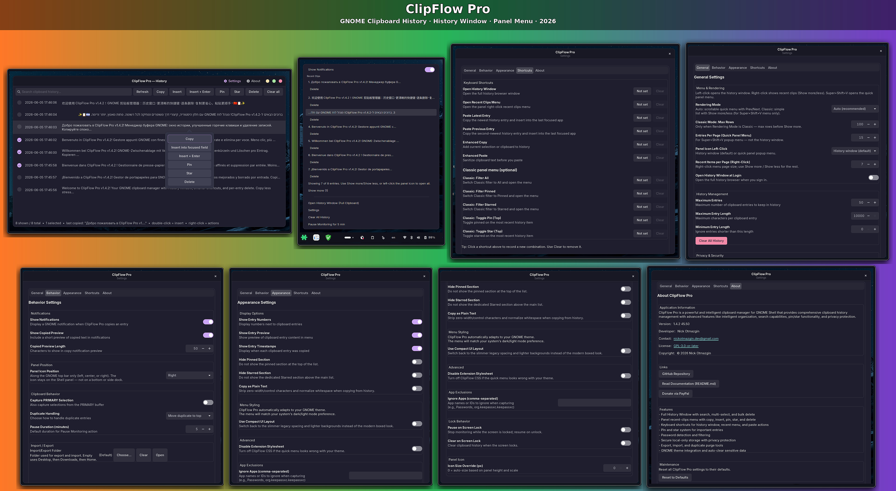
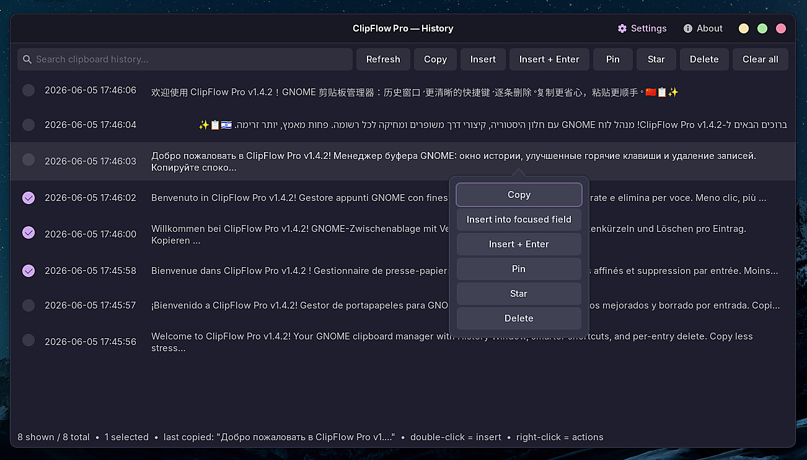
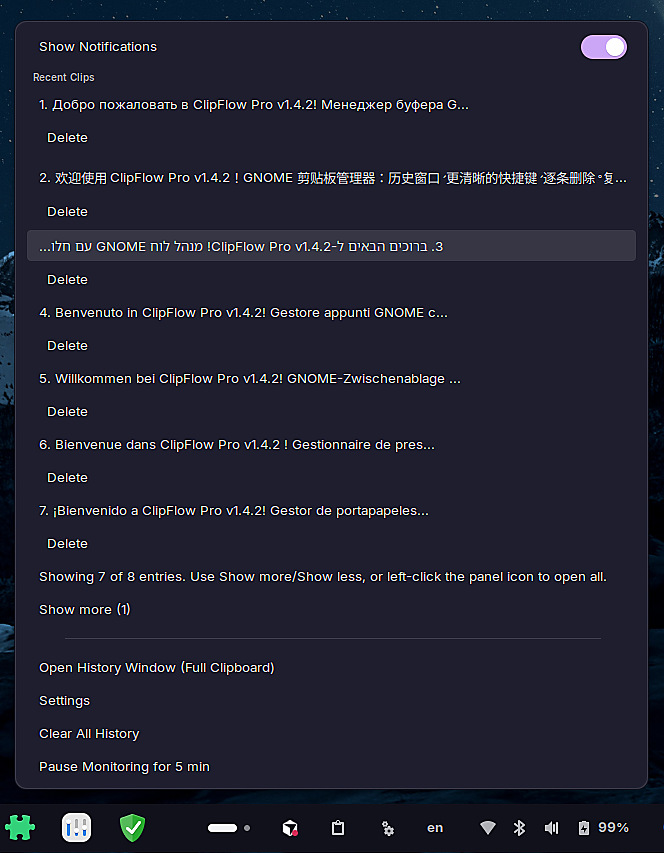
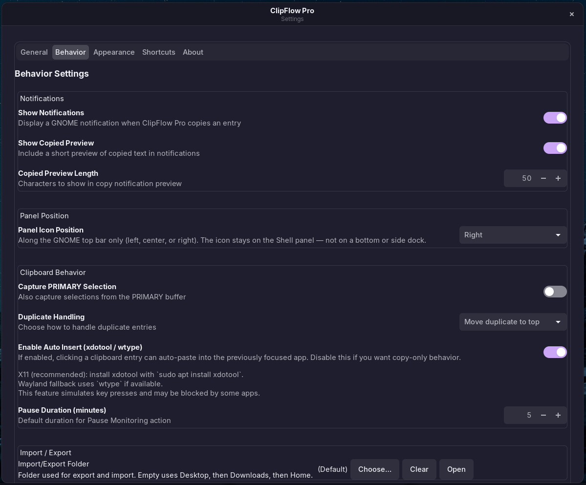
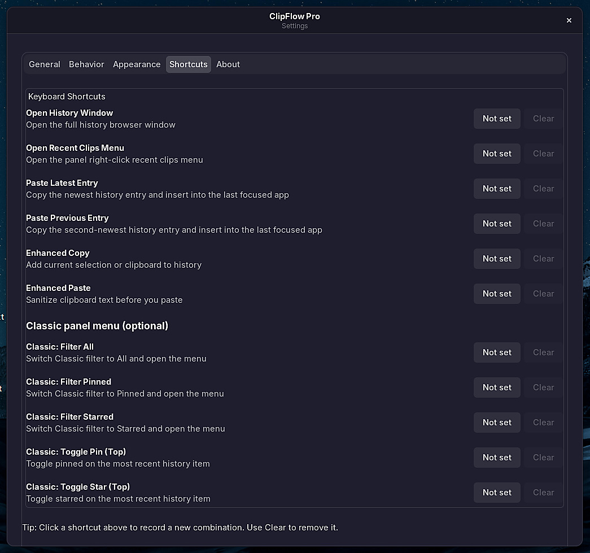
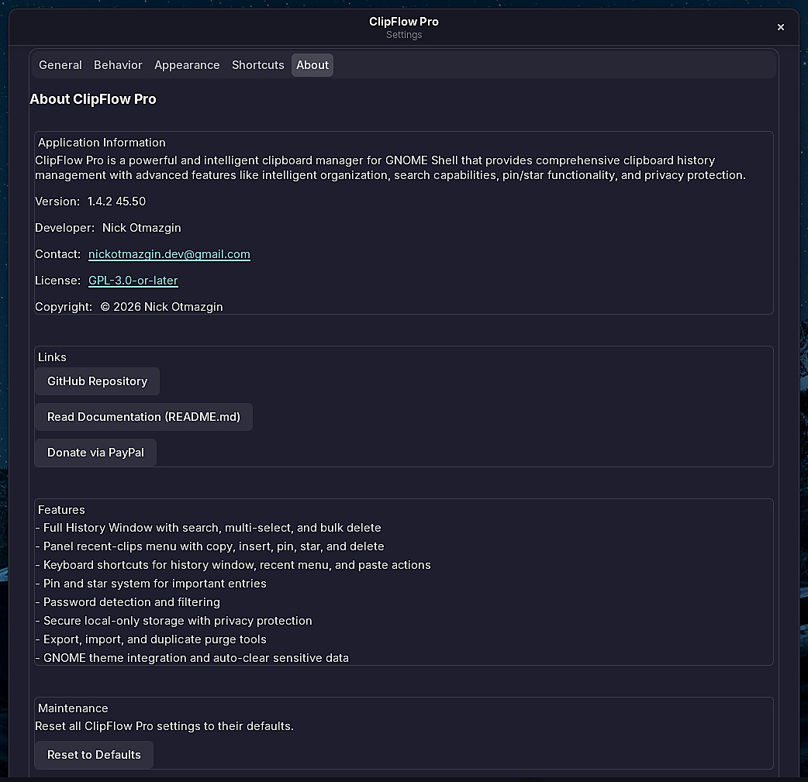

# ClipFlow Pro

[](https://github.com/nickotmazgin/clipflow-pro/releases/latest)
[](https://github.com/nickotmazgin/clipflow-pro/releases)
[](LICENSE)
[](#compatibility)
[](#compatibility)
[](#compatibility)

[](https://github.com/nickotmazgin/clipflow-pro/issues)
[](https://github.com/nickotmazgin/clipflow-pro/discussions)
[](https://github.com/sponsors/nickotmazgin)
[](https://www.paypal.com/donate/?hosted_button_id=4HM44VH47LSMW)

**ClipFlow Pro** is a clipboard history manager for GNOME Shell (UUID `clipflow-pro@nickotmazgin.github.io`).

> **Latest: v1.4.7** — Faster panel and History Window insertion, bounded clipboard reads, and backlog-free native monitoring. **Previous releases are superseded**; download only from [Releases](https://github.com/nickotmazgin/clipflow-pro/releases/latest).

> **GNOME Shell 43–44 is no longer supported.** ClipFlow Pro now targets **GNOME 45–50 only**. Upgrade your desktop environment to GNOME **45** or newer.

> **Keywords:** GNOME clipboard manager · Linux clipboard history · Wayland clipboard · history window · copy paste · productivity · privacy · open source

---

## Screenshots

### Main collage



### v1.4.2 highlights

| History window | Panel / recent clips | Settings → Behavior | Settings → Shortcuts | About → Maintenance |
|:---:|:---:|:---:|:---:|:---:|
|  |  |  |  |  |

Full combined image (download): [collage-v1.4.2-2026.jpg](screenshots/collage-v1.4.2-2026.jpg)

---

## What's new in v1.4.7

- **Faster insertion:** redundant fixed waits were removed from panel and History Window paste paths
- **Responsive History Window:** clipboard and keyboard helpers run asynchronously outside its UI process
- **Backlog-free monitoring:** only one native read per clipboard selection can be active at a time
- **Bounded recovery:** stalled clipboard owners cannot leave reads pending indefinitely
- **Zorin/X11 fallback:** a short-lived helper reads modern UTF-8 clipboard targets when St.Clipboard exposes none
- **Faster history sync:** 100 ms persistence and 50 ms History Window refresh debounces
- **Reliable capability detection:** `get_text`-only and `get_content`-only Shell implementations are supported
- **Privacy-safe diagnostics:** operational failures are visible without recording clipboard contents

## Also added in v1.4.6

- **No GNOME Shell freeze:** clipboard ownership and keyboard insertion run in short-lived helper processes
- **Paste follows focus:** the active app at paste time wins; the previously captured app is only a fallback
- **Terminal-aware paste:** kitty, GNOME/Zorin Terminal, Ghostty, WezTerm, and other terminals use `Ctrl+Shift+V` or `Shift+Insert`, never raw `Ctrl+V`
- **Stale target repair:** closed or replaced windows are rejected before insertion
- **Test coverage:** X11 integration smoke tests exercise real kitty and GNOME Terminal windows

## Also added in v1.4.3

- **Reliable paste into agent terminals** (Codex, Cursor Agents, etc.): plain-text clipboard via `xclip`/`wl-copy` plus direct keystroke typing when Ctrl+V is treated as image paste
- **History window insert** captures and restores the target app window; panel menu and history window now behave the same
- **ESM-safe** paste helpers (no broken `imports` load in GNOME Shell)

## What's new in v1.4.2

- **History Window header:** labeled **Settings** and **About** buttons (opens preferences on the right tab)
- **About → Maintenance:** confirm dialog before **Reset to Defaults**, with success toast
- **History Window:** multi-select checkbox delete removes all selected entries
- **Panel menu:** **Delete** row under each recent clip (right-click panel icon)
- **Shortcuts:** Open Recent Clips Menu, Paste Latest, Paste Previous, Classic filters/toggles
- **README / screenshots:** refreshed 2026 collage and highlight gallery

## What's new in v1.4.1 (important)

### History Window + insert workflow upgrades

A dedicated **desktop window** for browsing, searching, and managing clipboard history:

- **Left-click** the panel icon → opens the History Window (default)
- **Super+Shift+H** → same window
- Search, scroll, timestamps, pin/star markers
- **Copy**, **Insert**, **Insert + Enter**, **Pin**, **Star**, **Delete**, **Clear all**, **Refresh**
- Stays **in sync** with the panel menu via `~/.config/clipflow-pro/history.json`
- Requires **gjs** (GNOME JavaScript) — included on Zorin/Ubuntu/Fedora GNOME

### Panel interactions

| Action | Result |
|--------|--------|
| **Left-click** | History Window (full list) |
| **Right-click** | Recent clips menu with **Show more / Show less** paging |

### Also in v1.4.1

- GNOME 46 settings window: proper **close button** and Adw layout
- Rendering mode consolidated under **General → Menu & Rendering** (Auto / Classic)
- Right-click recent-clip menu now applies full **copy + insert** behavior
- Added **Enable Auto Insert (xdotool / wtype)** setting for copy-only fallback
- Show more/less no longer closes the menu unexpectedly
- Removed deprecated **Super+Shift+V** quick-menu shortcut path
- Numeric-style fixes: ESM-safe extension paths, scrollable enhanced menu on GNOME 45+

[Full changelog](CHANGELOG.md)

---

## Compatibility

| GNOME | Status | Notes |
|-------|--------|-------|
| **45–50** | **Supported** | History Window, ESM, enhanced panel menu — use `*-gs45-50.zip` |
| **43–44** | **Discontinued** | No longer built, distributed, or maintained |

**Minimum requirement:** GNOME Shell **45** or newer.

- Panel icon position: **left / center / right** on the GNOME **top bar** (not bottom/side docks)
- Distribution: **GitHub Releases only** (no extensions.gnome.org)

---

## Install

### From GitHub (recommended)

1. Download **`clipflow-pro@nickotmazgin.github.io-*-gs45-50.zip`** from **[Releases](https://github.com/nickotmazgin/clipflow-pro/releases/latest)** (GNOME 45–50 only).
2. Install:

```bash
gnome-extensions install --force clipflow-pro@nickotmazgin.github.io-1.4.7-gs45-50.zip
gnome-extensions enable clipflow-pro@nickotmazgin.github.io
# Alt+F2 → r → Enter
```

### Local build

```bash
./build.sh && ./install.sh
# Alt+F2 → r → Enter
```

---

## Quick Start

1. Copy something — it appears in history
2. **Left-click** panel icon → **History Window**
3. **Right-click** panel icon → recent clips + shortcuts
4. **Settings** → General → **Menu & Rendering** (Auto recommended)

### Features

- Pinned / Starred sections, content-type detection
- Export / Import, purge duplicates, password filtering
- Pause monitoring, clear on lock/logout
- Keyboard shortcuts (Settings → Shortcuts)

---

## Links

- **Releases:** https://github.com/nickotmazgin/clipflow-pro/releases
- **Issues:** https://github.com/nickotmazgin/clipflow-pro/issues
- **Changelog:** [CHANGELOG.md](CHANGELOG.md)

## More GNOME extensions by Nick Otmazgin

- [Numeric Clock](https://github.com/nickotmazgin/Linux-Numeric-Date-And-Clock) — DD/MM/YYYY 24-hour top-bar clock with seconds
- [Comfort Control (EaseHub)](https://github.com/nickotmazgin/comfort-control-easehub) — panel menu for power, screenshots, updates & utilities

---

## Support

[](https://github.com/sponsors/nickotmazgin)
[](https://www.paypal.com/donate/?hosted_button_id=4HM44VH47LSMW)
