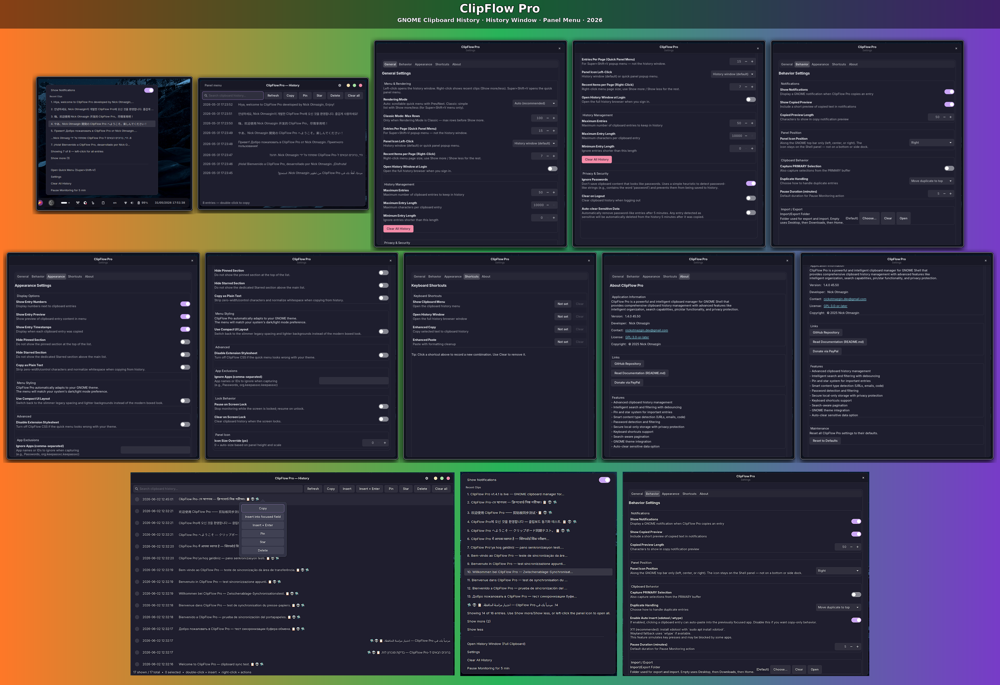
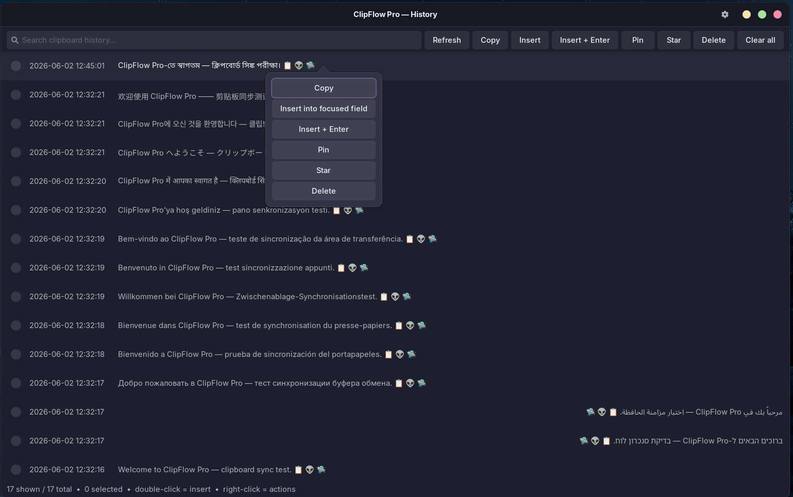
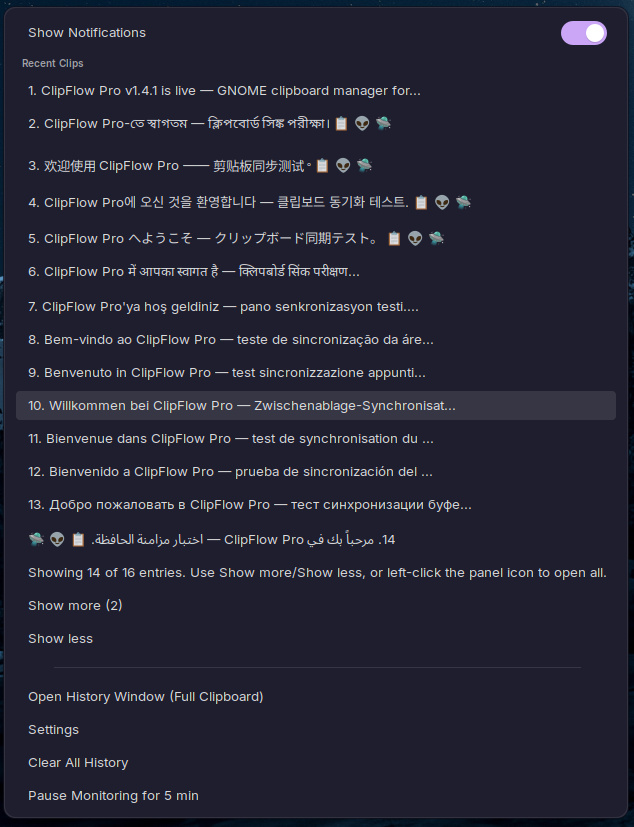

# ClipFlow Pro

[](https://github.com/nickotmazgin/clipflow-pro/releases)
[](https://github.com/nickotmazgin/clipflow-pro/releases)
[](LICENSE)
[](#compatibility)
[](#compatibility)
[](https://github.com/sponsors/nickotmazgin)

**ClipFlow Pro** is a clipboard history manager for GNOME Shell (UUID `clipflow-pro@nickotmazgin.github.io`).

> **Latest: v1.4.2** — refreshed GitHub social preview image. — shortcuts polish, bulk delete fix, and per-entry delete in the panel recent-clips menu. **Previous releases are superseded**; download only from [Releases](https://github.com/nickotmazgin/clipflow-pro/releases/latest).

> **Keywords:** GNOME clipboard manager · Linux clipboard history · Wayland clipboard · history window · copy paste · productivity · privacy · open source

---

## Screenshots

### Main collage



### v1.4.1 highlights (1 → 2 → 3)

| History window | Panel / recent clips | Settings → Behavior |
|:---:|:---:|:---:|
|  |  |  |

Full combined image (download): [collage-v1.4.1-2026.png](screenshots/collage-v1.4.1-2026.png)

---

## What's new in v1.4.1 (important)

### History Window + insert workflow upgrades

A dedicated **desktop window** for browsing, searching, and managing clipboard history:

- **Left-click** the panel icon → opens the History Window (default)
- **Super+Shift+H** → same window
- Search, scroll, timestamps, pin/star markers
- **Copy**, **Insert**, **Insert + Enter**, **Pin**, **Star**, **Delete**, **Clear all**, **Refresh**
- Stays **in sync** with the panel menu via `~/.config/clipflow-pro/history.json`
- Requires **gjs** (GNOME JavaScript) — included on Zorin/Ubuntu/Fedora GNOME

### Panel interactions

| Action | Result |
|--------|--------|
| **Left-click** | History Window (full list) |
| **Right-click** | Recent clips menu with **Show more / Show less** paging |

### Also in v1.4.1

- GNOME 46 settings window: proper **close button** and Adw layout
- Rendering mode consolidated under **General → Menu & Rendering** (Auto / Classic)
- Right-click recent-clip menu now applies full **copy + insert** behavior
- Added **Enable Auto Insert (xdotool / wtype)** setting for copy-only fallback
- Show more/less no longer closes the menu unexpectedly
- Removed deprecated **Super+Shift+V** quick-menu shortcut path
- Numeric-style fixes: ESM-safe extension paths, scrollable enhanced menu on GNOME 45+

[Full changelog](CHANGELOG.md)

---

## Compatibility

| GNOME | Build | Notes |
|-------|-------|-------|
| **45–50** | Main (`main`) | History Window, ESM, enhanced panel menu |
| **43–44** | Legacy zip | Classic panel menu only (no History Window) |

- Panel icon position: **left / center / right** on the GNOME **top bar** (not bottom/side docks)
- Distribution: **GitHub Releases only** (no extensions.gnome.org)

---

## Install

### From GitHub (recommended)

1. Download the zip for your Shell version from **[Releases](https://github.com/nickotmazgin/clipflow-pro/releases/latest)**:
   - `clipflow-pro@nickotmazgin.github.io-1.4.1-gs45-50.zip` — GNOME 45–50
   - `clipflow-pro@nickotmazgin.github.io-1.4.1-gs43-44.zip` — GNOME 43–44
2. Install:

```bash
gnome-extensions install --force clipflow-pro@nickotmazgin.github.io-1.4.1-gs45-50.zip
gnome-extensions enable clipflow-pro@nickotmazgin.github.io
# Alt+F2 → r → Enter
```

### Local build

```bash
./build.sh && ./install.sh
# Alt+F2 → r → Enter
```

---

## Quick Start

1. Copy something — it appears in history
2. **Left-click** panel icon → **History Window**
3. **Right-click** panel icon → recent clips + shortcuts
4. **Settings** → General → **Menu & Rendering** (Auto recommended)

### Features

- Pinned / Starred sections, content-type detection
- Export / Import, purge duplicates, password filtering
- Pause monitoring, clear on lock/logout
- Keyboard shortcuts (Settings → Shortcuts)

---

## Links

- **Releases:** https://github.com/nickotmazgin/clipflow-pro/releases
- **Issues:** https://github.com/nickotmazgin/clipflow-pro/issues
- **Changelog:** [CHANGELOG.md](CHANGELOG.md)

## More GNOME extensions by Nick Otmazgin

- [Numeric Clock](https://github.com/nickotmazgin/Linux-Numeric-Date-And-Clock) — DD/MM/YYYY 24-hour top-bar clock with seconds
- [Comfort Control (EaseHub)](https://github.com/nickotmazgin/comfort-control-easehub) — panel menu for power, screenshots, updates & utilities

---

## Support

[](https://github.com/sponsors/nickotmazgin)
[](https://www.paypal.com/donate/?hosted_button_id=4HM44VH47LSMW)
