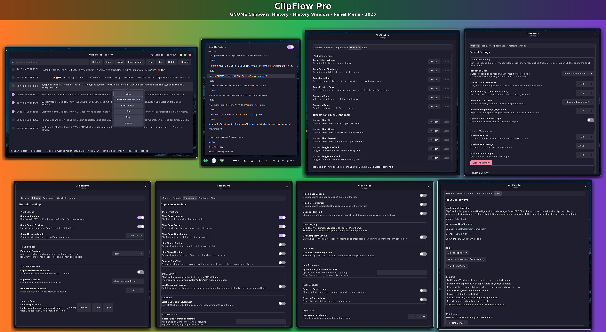
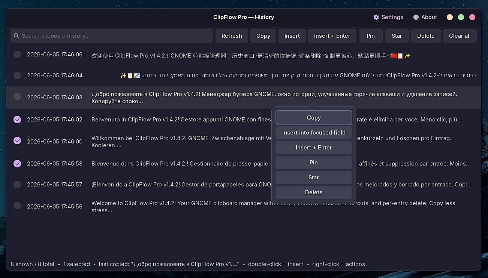
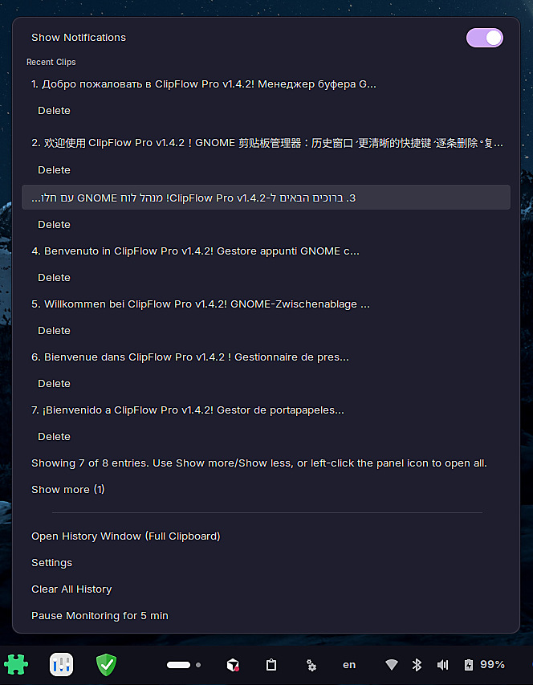
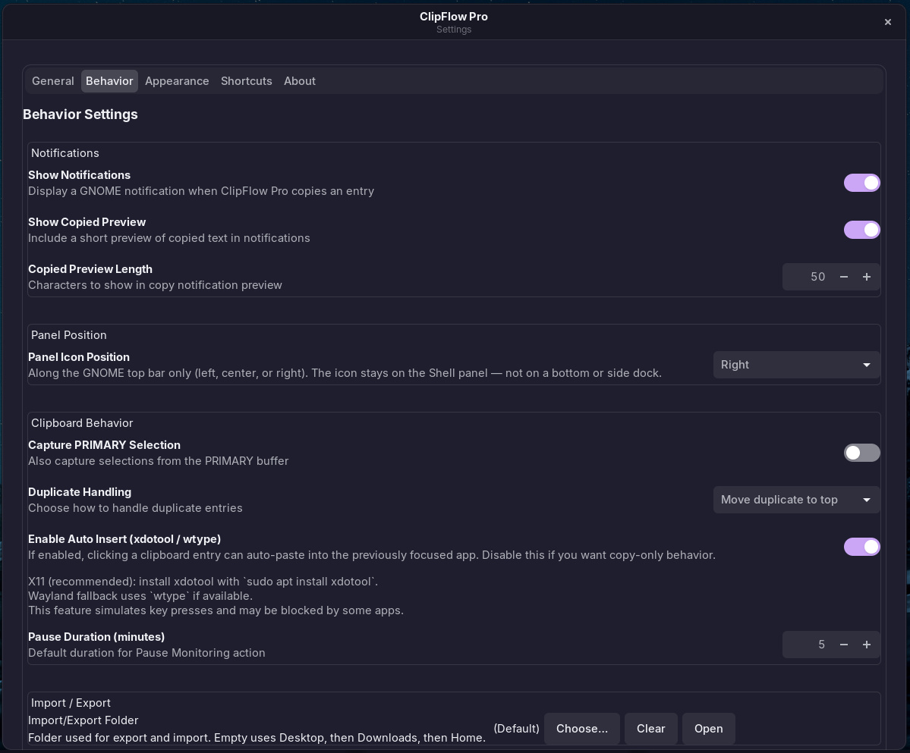
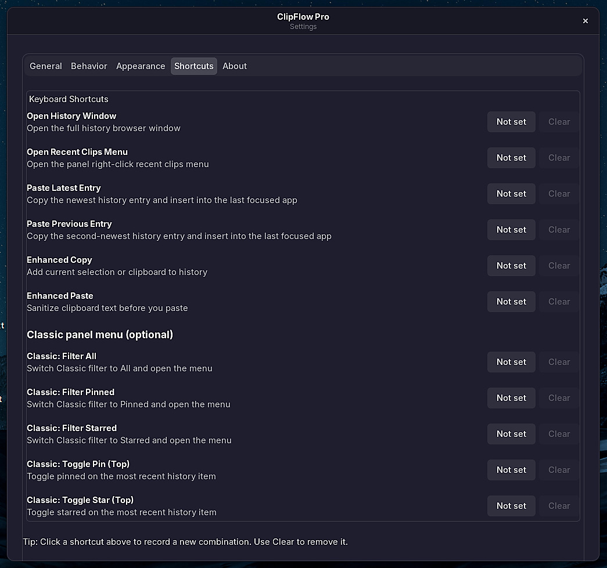
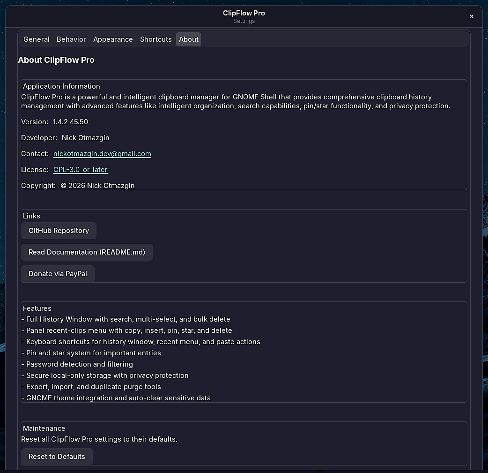

# ClipFlow Pro

[](https://github.com/nickotmazgin/clipflow-pro/releases/latest)
[](https://github.com/nickotmazgin/clipflow-pro/actions)
[](https://github.com/nickotmazgin/clipflow-pro/releases)
[](LICENSE)
[](#compatibility)
[](#compatibility)
[](#compatibility)
[](#compatibility)

[](https://github.com/nickotmazgin/clipflow-pro/issues)
[](https://github.com/nickotmazgin/clipflow-pro/discussions)

**ClipFlow Pro** is a clipboard history manager for **GNOME Shell 45–50** on **Wayland and X11/Xorg** sessions (UUID `clipflow-pro@nickotmazgin.github.io`).

> **Latest: v1.5.2** — Maintenance, lifecycle reliability, and privacy hardening. **Previous releases are kept for history**; download only from [Releases](https://github.com/nickotmazgin/clipflow-pro/releases/latest).

> **GNOME Shell 43–44 is no longer supported.** ClipFlow Pro now targets **GNOME 45–50 only**. Upgrade your desktop environment to GNOME **45** or newer.

> **Keywords:** GNOME clipboard manager · Linux clipboard history · Wayland · X11 · Xorg · history window · copy paste · productivity · privacy · open source

---

## Screenshots

### Main collage



### v1.4.2 highlights

| History window | Panel / recent clips | Settings → Behavior | Settings → Shortcuts | About → Maintenance |
|:---:|:---:|:---:|:---:|:---:|
|  |  |  |  |  |

Full combined image (download): [collage-v1.4.2-2026.jpg](screenshots/collage-v1.4.2-2026.jpg)

---

## What's new in v1.5.2

- **Lifecycle cleanup:** lock-screen signals, GLib timers, and panel handlers tear down cleanly on disable/destroy
- **Child process reaping:** history-window children no longer become zombies after repeated open/close
- **Private insert payloads:** collision-safe temp files created owner-only (`0600`) with cleanup on failure
- **Docs:** corrected GitHub Releases install path, flat ZIP layout, Wayland/X11 restart, and privacy wording

## Recent releases

Seven tagged releases on [GitHub](https://github.com/nickotmazgin/clipflow-pro/releases) (GNOME 45–50):

| Version | Highlights |
|---------|------------|
| **1.5.2** | Lifecycle cleanup, private insert payloads, documentation & privacy hardening |
| **1.5.1** | X11 CPU fix — native `St.Clipboard` first; no `xclip` subprocess on every poll |
| **1.5.0** | Reliable auto-insert, screenshot-safe capture, privacy defaults, Insert menu actions |
| **1.4.9** | Safe disable/upgrade — no `this._clipboard is null` race during in-flight reads |
| **1.4.7** | Faster paste, backlog-free monitoring, bounded recovery, Zorin/X11 UTF-8 fallback |
| **1.4.6** | Clipboard/insert helpers off the Shell thread; terminal-aware paste |
| **1.4.3** | Reliable paste into agent terminals; history-window insert matches panel behavior |

<details>
<summary><strong>Full changelog & older release notes</strong></summary>

Version-by-version notes (including withdrawn **1.4.8** and pre-1.4.3 history) live in **[CHANGELOG.md](CHANGELOG.md)**.

Highlights from earlier milestones:

- **1.4.2** — History Window Settings/About header, multi-select delete, panel Delete row, shortcut additions
- **1.4.1** — History Window (left-click panel icon, Super+Shift+H), enhanced menu rendering, GNOME 46 settings layout

</details>

---

## Compatibility

| GNOME | Status | Notes |
|-------|--------|-------|
| **45–50** | **Supported** | History Window, ESM, enhanced panel menu — use `*-gs45-50.zip` |
| **43–44** | **Discontinued** | No longer built, distributed, or maintained |

| Session | Status | Notes |
|---------|--------|-------|
| **X11 / Xorg** | **Supported · validated** | **v1.5.2** runtime-tested on Zorin OS 18.1 / GNOME Shell 46 / X11; native `St.Clipboard` first; `Alt+F2` → `r` after install |
| **Wayland** | **Supported** | Code paths + install docs; not maintainer runtime-tested on v1.5.2 — reports welcome |

**Minimum requirement:** GNOME Shell **45** or newer on a **Wayland or X11/Xorg** session.

> **Validation scope (v1.5.2):** maintainer confidence is highest on **X11/Xorg** (local Zorin setup). **Wayland** is supported by design and community use; older release notes were not retroactively re-labeled.

- Panel icon position: **left / center / right** on the GNOME **top bar** (not bottom/side docks)
- Distribution: **GitHub Releases only** (no extensions.gnome.org)

---

## Install

### From GitHub (recommended)

1. Download **`clipflow-pro@nickotmazgin.github.io-*-gs45-50.zip`** from **[Releases](https://github.com/nickotmazgin/clipflow-pro/releases/latest)** (GNOME 45–50 only).
2. Install:

```bash
gnome-extensions install --force clipflow-pro@nickotmazgin.github.io-1.5.2-gs45-50.zip
gnome-extensions enable clipflow-pro@nickotmazgin.github.io
# Wayland: log out/in · X11 only: Alt+F2 → r → Enter
```

### Local build

```bash
./build.sh && ./install.sh
# Wayland: log out/in · X11 only: Alt+F2 → r → Enter
```

---

## Quick Start

1. Copy something — it appears in history
2. **Left-click** panel icon → **History Window**
3. **Right-click** panel icon → recent clips + shortcuts
4. **Settings** → General → **Menu & Rendering** (Auto recommended)

### Features

- Pinned / Starred sections, content-type detection
- Export / Import, purge duplicates, password filtering
- Pause monitoring, clear on lock/logout
- Keyboard shortcuts (Settings → Shortcuts)

---

## Links

- **Releases:** https://github.com/nickotmazgin/clipflow-pro/releases
- **Issues:** https://github.com/nickotmazgin/clipflow-pro/issues
- **Changelog:** [CHANGELOG.md](CHANGELOG.md)

## More GNOME extensions by Nick Otmazgin

- [Numeric Clock](https://github.com/nickotmazgin/Linux-Numeric-Date-And-Clock) — DD/MM/YYYY 24-hour top-bar clock with seconds
- [Comfort Control (EaseHub)](https://github.com/nickotmazgin/comfort-control-easehub) — panel menu for power, screenshots, updates & utilities

---

## Credits & Acknowledgements

ClipFlow Pro is created, maintained, signed, and released by **[Nick Otmazgin](https://github.com/nickotmazgin)** — the project's sole administrator and solo developer, who authors and reviews all code that ships.

[](https://openai.com/codex/)
[](https://cursor.com)

Recent releases were built with help from AI pair-programming agents, operated under the maintainer's direction and review:

- **OpenAI Codex** — clipboard capture/persistence performance work, terminal paste reliability, release engineering, signing, and validation
- **Cursor (Agent)** — code review, debugging, automated testing workflows, and documentation

Every AI-assisted change is human-reviewed, tested on real GNOME sessions, and approved by the maintainer before release. See [CONTRIBUTORS.md](CONTRIBUTORS.md) for the full credits.

> OpenAI and Codex are trademarks of OpenAI. Cursor is a trademark of Anysphere, Inc. These names are used here solely for factual attribution. ClipFlow Pro is an independent project and is **not** affiliated with, sponsored, or endorsed by OpenAI or Anysphere/Cursor.

---

## Support

[](https://www.paypal.com/donate/?hosted_button_id=4HM44VH47LSMW)
